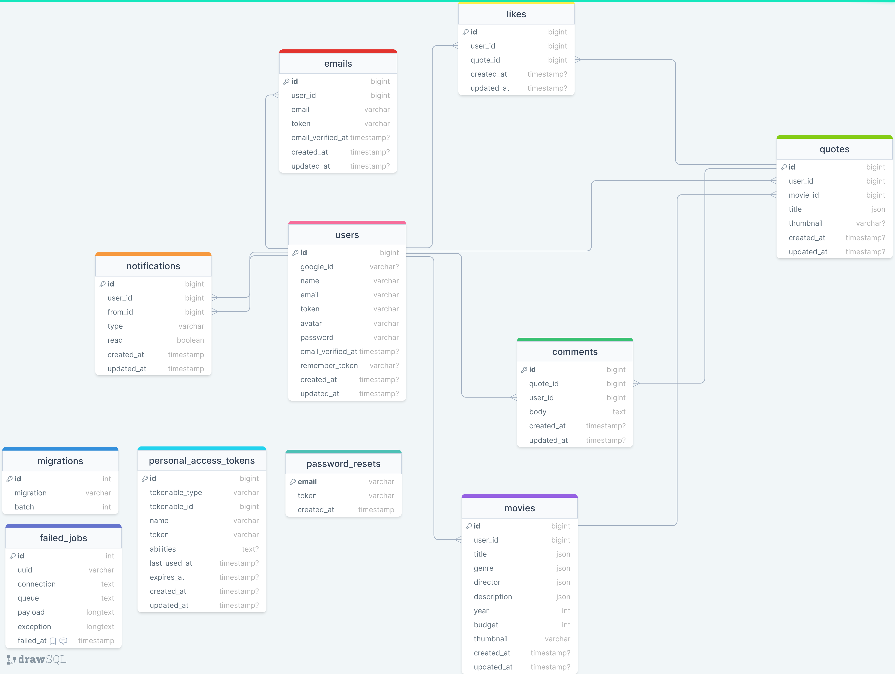

# Epic movie quotes API

### Table of Contents

-   [Prerequisites](#prerequisites)
-   [Tech Stack](#tech-stack)
-   [Getting Started](#getting-started)
-   [Migrations](#migration)
-   [Development](#development)
-   [Database structure](#database-structure)

#

## Introduction

---

Epic movie quotes is a social network where people can find any quote in millions of movie lines. Express their feelings opinions about different movies and more...

#

### Prerequisites

-   *PHP@7.2 and up*
-   _SQLite_
-   _npm@6 and up_
-   _composer@2 and up_

#

### Tech Stack

-   [Laravel@6.x](https://laravel.com/docs/6.x) - back-end framework
-   [JWT Auth](https://github.com/firebase/php-jwt) - Authentication system
-   [Spatie Translatable](https://github.com/spatie/laravel-translatable) - package for translation
-   [pusher](https://laravel.com/docs/9.x/broadcasting#pusher-channels) - Powering realtime experiences for mobile and web
-   [laravel echo](https://laravel.com/docs/9.x/broadcasting#listening-for-events) - a JavaScript library that makes it painless to subscribe to channels and listen for events broadcast by your server-side broadcasting driver

#

### Getting Started

1\. First of all you need to clone E Space repository from github:

```sh
git clone https://github.com/RedberryInternship/bakar-tsutskiridze-epic-movie-quotes-back.git
```

2\. Next step requires you to run _composer install_ in order to install all the dependencies.

```sh
composer install
```

3\. after you have installed all the PHP dependencies, it's time to install all the JS dependencies:

```sh
npm install
```

and also:

```sh
npm run dev
```

in order to build your JS/SaaS resources.

4\. Now we need to set our env file. Go to the root of your project and execute this command.

```sh
cp .env.example .env
```

And now you should provide **.env** file all the necessary environment variables:

#

**SQLite:**

> DB_CONNECTION=sqlite

#

after setting up **.env** file, execute:

```sh
php artisan config:cache
```

in order to cache environment variables.

Now execute in the root of you project following:

```sh
  php artisan key:generate
```

Which generates auth key.

Now execute in the root of you project following:

```sh
  php artisan jwt:secret
```

##### Now, you should be good to go!

#

### Migration

if you've completed getting started section, then migrating database if fairly simple process, just execute:

```sh
php artisan migrate
```

#

### Development

You can run Laravel's built-in development server by executing:

```sh
  php artisan serve
```

when working on JS you may run:

```sh
  npm run dev
```

it builds your js files into executable scripts.
If you want to watch files during development, execute instead:

```sh
  npm run watch
```

it will watch JS files and on change it'll rebuild them, so you don't have to manually build them.

#

## database structure


